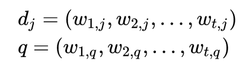

# Vector Space Model
텍스트 문서를 단어 색인 등의 식별자오 구성된 벡터로 표현하는 대수적 모델

## Definition
문서와 질의는 벡터로 표현된다.  

 
각각의 demension 은 개별 단어에 대응된다. 어떤 단어가 문서에 포함되면, 해당 단어는 0이 아닌 벡터 값을 갖는다. 
단어 가중치라고 불리는 이 값을 산출하기 위해 사용하는 방법에는 여러 가지가 있으며, 가장 잘 알려진 방법은 tf-idf 방식이다.  
벡터의 차원의 크기는 collection 에 포함된 term 의 갯수와 같다.  
벡터 연산은 문서들 간의 유사성을 비교하는 데에도 사용될 수 있다.
